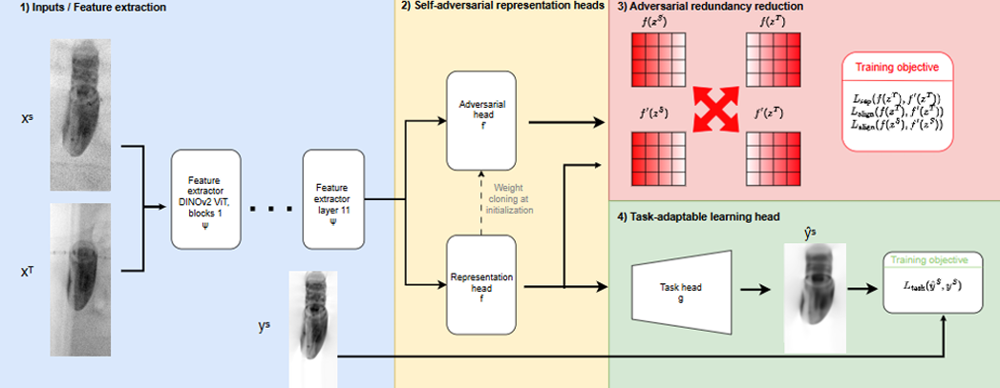

<!-- LOGO: put the file in figures/ and keep the name below -->

  

# Foundation Models & Unsupervised Domain Adaptation for 2D Probe Pose Estimation

**Research internship · GE HealthCare, Interventional Image Processing R&D · Buc, France · May – August 2026**

Supervised by Vincent Jugnon and Gauthier Miralles. Engineering school: IMT Nord Europe.

> This repository is a write-up, not a codebase. There is no code, no data and no numbers in it —
> the pipeline and the results belong to GE HealthCare. What I can share is the problem, how we
> approached it, and what I actually worked on.

---

## The problem

Some heart procedures are done on a beating heart, without opening the chest — replacing an
aortic valve, repairing a mitral valve, closing the left atrial appendage.

They need two kinds of imaging at the same time, because neither one is enough:

- **X-ray (fluoroscopy)** shows the catheters and the implants, but not soft tissue. The
  cardiologist cannot see the valve he has to cross.
- **Ultrasound (from a probe inside the esophagus)** shows exactly that soft tissue, but barely
  shows the metal instruments.

So two specialists work side by side, each on their own screen, and each has to picture in their
head how one image maps onto the other. It works, but it takes experience and it adds mental load
in the middle of a delicate gesture.

The idea behind the project is to merge the two views: draw the ultrasound cone directly on the
X-ray image, in the right place. To do that, you need to know where the ultrasound probe is at
every moment — its **position and orientation** in the X-ray image. That is the pose.

## How the team estimates that pose

When I arrived, the team already had a working pipeline that reads the pose from a **single**
X-ray image, with no tracking sensor attached to the probe. It doesn't predict the angles
directly, which surprised me at first. It works by comparison instead:

1. The image is recentred, aligned and resized first, so only two rotation angles are left to
   find.
2. An **encoder** turns the image into a vector.
3. That vector is compared, by cosine similarity, to a **bank of reference images** ("templates")
   — clean renderings of the probe at angles we know exactly.
4. The output is a **ranked list of candidates**. The first one is the estimated pose.

We score it with **Top-1** and **Top-10 success**: is the right template ranked first, or at
least in the top ten? And to see *why* a model works or doesn't, we look at a heatmap of
similarity over all the angles. A good encoder gives a sharp peak on the true pose. A model that
gives a flat map has understood nothing, even if its best guess happens to be right.

## The catch: a real image can never be labelled

Nothing measures the probe pose during a real procedure. There is no sensor. Which means
**clinical images can never be annotated** — you can't train on them.

So the training images are generated: a rendering of the probe at a known angle is composited
onto a real clinical background. Realistic to look at, and with an exact ground truth.

For validation we keep two sets: a synthetic one, and images actually acquired in a test room on
anatomical phantoms. The second one is the only case where we have both a physically acquired
image and a pose we control.

Watching both during training tells you how much performance you lose when you leave the images
you trained on. That gap is the story of the whole internship. The first part of my work tried to
close it with a better representation. The second part attacked it head-on.

---

## Part 1 — Looking for a better encoder

The pipeline used a CNN built in-house, and it already worked well. My question was open-ended:
could a recent **foundation model** do better in the same pipeline?

**What I did:**

- **Read the literature properly before touching any code.** Instead of trying architectures as I
  came across them, I built a comparison table: around 30 papers screened, 10 encoders kept, each
  scored on what mattered for us — output vector size, model size, and above all *what kind of
  images it was pretrained on*.
- **Chose candidates for how close they were to our images**, not for their benchmark scores.
  *RAD-DINO*, pretrained mostly on chest X-rays — the same part of the body as our case.
  *FluoroSAM*, trained on fluoroscopy — literally our image type. And later, on my supervisors'
  advice, *DINOv2*, a generalist model, much less specialised but far better documented.
- **Set up one shared protocol** so the comparison meant something: same pipeline, same template
  bank, same evaluation on both domains at regular intervals during training, plus heatmaps to
  look at the failures.
- **Went through the adaptation strategies** from cheapest to most expensive: zero-shot, then a
  frozen backbone with a small trained head, then **LoRA** (testing several ranks), then full
  fine-tuning.

**The thing I actually learned here.** Pretrained models are far more sensitive to their **input
preprocessing** than to how you fine-tune them. Their papers rarely document that preprocessing
completely, and getting it wrong quietly ruins everything downstream. Once I found the faithful
version and re-ran the comparison, the ranking of the methods changed. Finding that out was the
turning point of this first part — and a habit I'll keep: before comparing models, make sure
you're feeding them what they expect.

---

## Part 2 — Unsupervised domain adaptation

### The idea

You have **labelled** images from one domain (the *source*), and **unlabelled** images from
another (the *target*) — and the target is the one you actually care about. Same task, but the
images don't look the same: different noise, contrast, texture, or objects in the frame.

Train only on the source, and the model quietly learns to rely on details specific to it. Show it
the target, and it falls apart.

Unsupervised domain adaptation tries to fix that **without ever using a label on the target**.
The goal is a representation that is *blind to the domain*: if the vector no longer tells you
which domain the image came from, but still tells you what you need for the task, then a head
trained on the source keeps working on the target.

### Why our case wasn't the textbook one

Almost all published UDA work deals with **classification** — pick one label out of a few. Our
task is a **regression**: the vector goes into a decoder that has to reconstruct an image, scored
by a continuous loss. Methods designed to shift decision boundaries between classes don't
transfer mechanically to that. The whole thing had to be reformulated, and re-evaluated, in a
regression setting.

### Building a benchmark we could trust

The domain we really care about is the clinical one — but it has no ground truth, so there is no
way to check whether adaptation worked at all. I needed a source/target pair where I controlled
the gap and knew the angles on **both** sides.

I built it from a single base of templates, changing only **which physical parts of the probe are
visible**: the insertion tube on the source side, and the ring and shielding of a newer probe
model on the target side. Those parts show up as bright, opaque shapes that sit on top of the
probe and hide part of the geometry the encoder relies on.

The shift is close to what happens in the clinic, but it comes down to a single variable. The
target angles exist, by construction — but the model never sees them during training. They are
only used afterwards, to measure whether it worked.

Put simply: the model has to stop looking at those parts, and keep only the shape of the probe.

### The method

The adaptation builds on **FARR** (*Feature Alignment and Redundancy Reduction*), from my second
supervisor's work — paper under review, reference implementation public.

The backbone is cut in two at a chosen block. The lower blocks become a **shared extractor ψ**,
the upper ones the **task head f**. Next to them sit the reconstruction **decoder g** and an
**adversarial branch f_adv**, which is a copy of the upper blocks reading the same intermediate
output as f.

<!-- FIGURE: put the file in figures/ and keep the name below -->

  

<em>
  Figure 1 — <!-- your one-line caption here -->
</em>

**Reading the diagram**

<!-- Your own walkthrough goes here. A possible skeleton:
     1. Inputs / feature extraction — what xˢ and xᵗ are, and where ψ stops
     2. The two heads — why f_adv starts as a copy of f
     3. Redundancy reduction — what the two matrices are being compared for
     4. Task head — what g reconstructs, and against what
     Delete this comment once you've written it. -->

Every iteration does three things in a row: the task path learns on the regression loss, computed
on the labelled source only; the adversarial branch learns to pick up whatever the task head is
*not* using; then ψ is pushed to satisfy the regression loss **and** the alignment terms across
both domains.

f_adv points at what still gives the domain away, ψ learns to erase it. Two networks pulling
against each other — which is exactly what makes this kind of training hard to keep stable.

### Where most of my time went

The method was solid and already validated — on classification and segmentation, on other
datasets. Nothing said it would behave on a regression task, with our backbone and our kind of
domain shift. No reference hyperparameters, no published number to aim at. Only experiments could
answer it, and that's where my contribution sits.

- **Integrating** the architecture into the existing pose pipeline, starting from the best
  encoder configuration found in part 1.
- **Automating the hyperparameter search** with **Optuna** (Bayesian TPE sampling), in two
  successive campaigns: the loss weights first, at fixed learning rates, then the learning rates
  at the best weights found. Splitting it this way keeps each search in a much smaller space.
  Weak trials get pruned early, diverging ones are recorded with a zero score so the sampler
  learns where the cliff is, and the whole study is stored in a database so an interrupted search
  can be resumed.
- **Thinking about the adversarial balance instead of only sweeping it.** Where you cut the
  backbone isn't a neutral choice — it decides how much capacity each side of the fight gets. Two
  networks of similar size are hard to stabilise, and ψ has the harder job: stay good at the task
  *while* fooling its opponent. Cutting much deeper, leaving the adversary a single block, leans
  on something known about vision transformers — deep features are more abstract, so already
  partly free of low-level domain cues — while still leaving the adversary enough to spot what's
  left. A lower learning rate on that side helps too, as usual in adversarial training.
- **Checking it transfers.** I ran the same protocol on the in-house CNN encoder, to see whether
  the gains hold on a different family of encoder, picking its split point so that the comparison
  followed the same capacity logic.

---

## What I take away from these four months

- When the ground truth **cannot exist**, designing the evaluation becomes as much of a
  deliverable as the model itself.
- Faithfully reproducing a pretrained model is a piece of research in itself. Skip it and every
  comparison you build on top is worthless.
- Adversarial training is less about the loss terms than about the **balance** between the two
  sides — capacity, and how fast each one learns.
- One variable at a time. Protocol fixed before the numbers arrive.

It also settled something for me: I want to work in research, and I'm now seriously considering a
PhD.

## Tools

PyTorch · DINOv2 and vision transformers · LoRA · Optuna · multi-GPU training · Git

**Keywords:** medical imaging, deep learning, pose estimation, template matching, foundation
models, unsupervised domain adaptation, adversarial training, interventional cardiology
